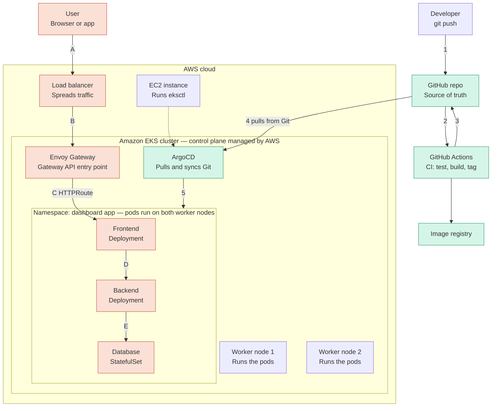

# GitOps Architecture — DevBoard on EKS

How a `git push` turns into a running change on the EKS cluster: GitHub
Actions builds and tags images, ArgoCD pulls and syncs the manifests, and
Envoy Gateway (behind an AWS NLB) routes user traffic into the 3-tier app.

## Diagram



### Text-only fallback (no Mermaid renderer)

```
 Developer --(1) git push--> GitHub repo <--(2/3)--> GitHub Actions --> Image registry
                                   |
                                   | (4) pulls from Git
                                   v
 ================== AWS cloud ==================================
 |  EC2 instance --runs eksctl--> [provisions]                  |
 |                                                               |
 |  ===== Amazon EKS cluster (control plane managed by AWS) ===  |
 |  |  ArgoCD  --(5)--> Namespace: dashboard-app              |  |
 |  |                                                          |  |
 |  |  Load balancer --(B)--> Envoy Gateway --(C HTTPRoute)--> |  |
 |  |      Frontend --(D)--> Backend --(E)--> Database         |  |
 |  |                                                          |  |
 |  |  Worker node 1            Worker node 2                 |  |
 |  |  (runs the pods)          (runs the pods)                |  |
 |  ===========================================================  |
 ================================================================
                                   ^
                                   | (A) user request
                                   |
                               User (browser or app)
```

## Flow reference

### Delivery flow — Git to cluster

| Step | From | To | What happens |
|---|---|---|---|
| 1 | Developer | GitHub repo | `git push` to `main` — the repo is the single source of truth. |
| 2 | GitHub repo | GitHub Actions | Push triggers `ci-pipeline.yml`. |
| 3 | GitHub Actions | GitHub repo | After build, the `update-manifests` job commits the new image tag back into `k8s/eks/*-deployment.yml` and pushes it (`[skip ci]`). |
| — | GitHub Actions | Image registry | Backend and frontend images are built and pushed, tagged with the short git SHA and `latest`. |
| 4 | GitHub repo | ArgoCD | ArgoCD's `Application` (watching `k8s/eks/`, `targetRevision: main`) detects the new commit and pulls it. |
| 5 | ArgoCD | Namespace: dashboard app | ArgoCD applies/syncs the manifests into `devboard-ns`, with `prune: true` and `selfHeal: true`. |

### User request path

| Step | From | To | What happens |
|---|---|---|---|
| A | User (browser/app) | Load balancer | Request hits the AWS Network Load Balancer provisioned by the AWS Load Balancer Controller. |
| B | Load balancer | Envoy Gateway | NLB forwards to the Envoy Gateway `Service` (the Gateway API data plane). |
| C | Envoy Gateway | Frontend | Routed via an `HTTPRoute` bound to the `Gateway`. |
| D | Frontend | Backend | Frontend deployment calls the backend API. |
| E | Backend | Database | Backend reads/writes Postgres, running as a `StatefulSet` backed by a dynamically-provisioned EBS volume (`ebs-gp3` `StorageClass`). |

## CI/CD pipeline (GitHub Actions)

| Workflow | Trigger | Responsibility |
|---|---|---|
| `ci-pipeline.yml` | push to `main`, or manual dispatch | Orchestrates the two workflows below in sequence. |
| `build-and-push.yml` | called by `ci-pipeline.yml` | Builds `backend/` and `frontend/` Docker images, pushes both to Docker Hub tagged `<short-sha>` and `latest`, outputs the tag. |
| `update-manifests.yml` | called by `ci-pipeline.yml`, needs `build-and-push` | Rewrites the image tag in `k8s/eks/08-backend-deployment.yml` and `k8s/eks/10-frontend-deployment.yml`, commits, and pushes — this commit is what ArgoCD picks up. |

## Cluster components

| Component | Role |
|---|---|
| EC2 instance | Runs `eksctl` to provision/manage the EKS cluster and its nodegroup. |
| Amazon EKS cluster | Managed Kubernetes control plane; 2 worker nodes (`t3.medium`) run the app pods. |
| ArgoCD | GitOps controller — watches `k8s/eks/` in this repo, applies changes, self-heals drift. |
| Envoy Gateway | Gateway API implementation; single entry point for all north-south traffic. |
| AWS Load Balancer Controller | Provisions the AWS NLB that fronts Envoy Gateway's `Service`. |
| EBS CSI driver | Dynamically provisions the EBS volume backing the Postgres `StatefulSet`. |

## k8s/eks manifest layout

| File | Resource |
|---|---|
| `01-namespace.yml` | `devboard-ns` namespace |
| `02-configmap.yml` | App configuration |
| `03-secrets.yml` | Credentials (e.g. DB password) |
| `04-postgres-storageclass.yml` | `ebs-gp3` dynamic `StorageClass` |
| `05-postgres-init.yml` | Schema/seed init data |
| `06-postgres-statefulset.yml` | Postgres `StatefulSet` + PVC |
| `07-postgres-service.yml` | Postgres `Service` |
| `08-backend-deployment.yml` | Backend `Deployment` (image tag updated by CI) |
| `09-backend-service.yml` | Backend `Service` |
| `10-frontend-deployment.yml` | Frontend `Deployment` (image tag updated by CI) |
| `11-frontend-service.yml` | Frontend `Service` |
| `12-gateway-api.yml` | `Gateway` + `HTTPRoute` |
| `13-envoyproxy.yml` | Envoy Gateway `Service` (`type: LoadBalancer`, AWS NLB annotations) |

See [`README_EKS.md`](README_EKS.md) for the full cluster bootstrap walkthrough.
